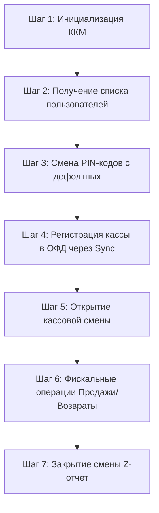

# Руководство по быстрому старту (Quick Start Guide)

Это руководство описывает правильную последовательность действий для запуска онлайн-кассы «Superkassa» с нуля, прохождения синхронизации с ОФД (Фискализации) и проведения первых операций.

---

## 1. Где взять параметры для настройки?

Для инициализации кассы и ее связи с ОФД (на примере Казахтелеком) вам понадобятся:
1. **Идентификатор системы в ОФД (`ofdSystemId`)**: Выдается ОФД при регистрации кассы в личном кабинете. В тестовом контуре используется тестовый ID (например, `203605`).
2. **Токен ОФД (`ofdToken`)**: Секретный токен связи, выдаваемый ОФД для конкретной кассы. В тестовом контуре используется тестовый токен (например, `90127062`).
3. **ОКЭД (`okved`)**: Общий классификатор видов экономической деятельности (5 цифр). Например:
   - `47110` — Розничная торговля в неспециализированных магазинах преимущественно продуктами питания.
   - `47301` — Розничная торговля моторным топливом.
   ОКЭД вашей организации можно узнать на портале stats.gov.kz по БИН/ИИН.

---

## 2. Пошаговая последовательность интеграции (API Flow)

Категорически запрещено пробивать чеки или открывать смены до завершения шагов инициализации и смены PIN-кодов. Правильная цепочка шагов представлена ниже:



### Шаг 1. Инициализация кассы (Init KKM)
Первоначальное создание кассы в базе данных сервера. При создании касса имеет дефолтный PIN-код администратора `0000`.

* **Метод**: `POST /kkm/init`
* **Заголовок**: `Authorization: Bearer 0000`
* **Тело запроса (JSON)**:
```json
{
  "ofdId": "kazakhtelecom",
  "ofdEnvironment": "test",
  "ofdSystemId": "203605",
  "ofdToken": "90127062",
  "defaultVatGroup": "NO_VAT",
  "okved": "47110"
}
```
* **Ответ**: Возвращает `kkmId` (UUID кассы, например `fb831398-f9af-4bd2-bee1-c28046d8953a`).

---

### Шаг 2. Получение списка пользователей (List Users)
При инициализации сервер автоматически создает двух системных пользователей: Администратора (`ADMIN`) и Кассира (`CASHIER`). Для смены их PIN-кодов нужно узнать их уникальные `userId`.

* **Метод**: `GET /kkm/{kkmId}/users`
* **Заголовок**: `Authorization: Bearer 0000` (дефолтный пин)
* **Ответ**: Список пользователей с их ролями и ID.

---

### Шаг 3. Безопасная смена PIN-кодов (Change PINs)
По закону запрещено вести деятельность с PIN-кодами по умолчанию. Обновите их.

1. **Смена PIN администратора (на `4321`)**:
   * **Метод**: `PUT /kkm/{kkmId}/users/{adminUserId}`
   * **Заголовок**: `Authorization: Bearer 0000`
   * **Тело запроса**: `{"userPin": "4321"}`

2. **Смена PIN кассира (на `1234`)**:
   * **Метод**: `PUT /kkm/{kkmId}/users/{cashierUserId}`
   * **Заголовок**: `Authorization: Bearer 4321` (авторизуемся новым пином администратора)
   * **Тело запроса**: `{"userPin": "1234"}`

---

### Шаг 4. Регистрация и синхронизация с ОФД (Sync OFD)
Для того чтобы касса получила регистрационный номер налогоплательщика (RECNUM) и данные об организации от ОФД, нужно войти в режим программирования и запустить синхронизацию.

1. **Вход в режим программирования**:
   * **Метод**: `POST /kkm/{kkmId}/programming/enter`
   * **Заголовок**: `Authorization: Bearer 4321` (пин администратора)

2. **Запуск синхронизации**:
   * **Метод**: `POST /kkm/{kkmId}/ofd/sync`
   * **Заголовок**: `Authorization: Bearer 4321`
   * *Сервер свяжется с ОФД, получит название компании, БИН, адрес установки и токен авторизации.*

3. **Выход из режима программирования**:
   * **Метод**: `POST /kkm/{kkmId}/programming/exit`
   * **Заголовок**: `Authorization: Bearer 4321`

---

### Шаг 5. Открытие смены (Open Shift)
Перед началом любых продаж кассир должен открыть смену. Длительность смены по закону не должна превышать 24 часа.

* **Метод**: `POST /kkm/{kkmId}/shift/open`
* **Заголовок**: `Authorization: Bearer 1234` (пин кассира) или `Authorization: Bearer 4321`

---

### Шаг 6. Выбивание чеков продажи (Create Sell Receipt)
Основная операция кассира. Чек отправляется в ОФД в режиме реального времени. В случае отсутствия интернета чек автоматически подписывается локально автономной подписью и уходит в оффлайн-очередь (`OFFLINE_QUEUED`).

* **Метод**: `POST /kkm/{kkmId}/receipt/sell`
* **Заголовок**: `Authorization: Bearer 1234`
* **Тело запроса (JSON)**:
```json
{
  "idempotencyKey": "unique-uuid-or-timestamp",
  "items": [
    {
      "name": "Coca-Cola 0.5L",
      "price": 450.00,
      "quantity": 2,
      "vatGroup": "NO_VAT",
      "measureUnitCode": "796"
    }
  ],
  "payments": [
    {
      "type": "CASH",
      "sum": 900.00
    }
  ]
}
```

---

### Шаг 7. Закрытие смены / Z-отчет (Close Shift)
В конце рабочего дня смена закрывается с отправкой Z-отчета в ОФД.

* **Метод**: `POST /kkm/{kkmId}/shift/close`
* **Заголовок**: `Authorization: Bearer 4321` (пин администратора) или `Bearer 1234`

---

## 3. Полезные справочные коды

- **Код штучного товара (measureUnitCode)**: `796` (Штука по классификатору СИ).
- **Налоговые группы (vatGroup)**:
  - `NO_VAT` — Без НДС.
  - `VAT_12` — НДС 12% (основная ставка в Казахстане).
  - `VAT_0` — НДС 0%.
